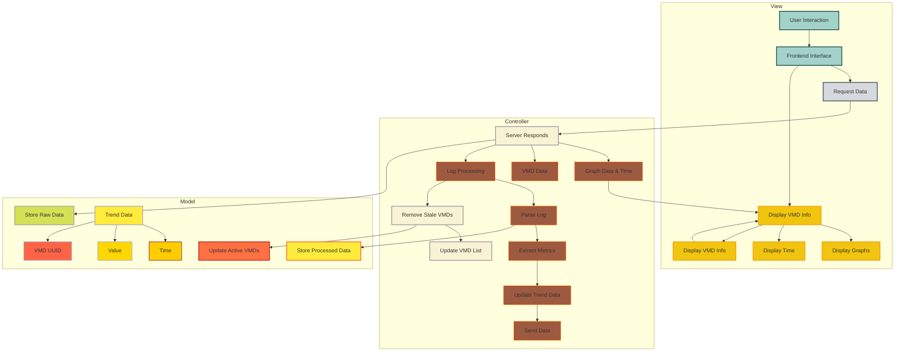

# Trends Metrics UI

The Trends Metrics UI provides a web application to monitor and visualize trends in real-time based on logs. It extracts
metrics from a log file, updates the data, and generates interactive graphs. The web interface displays the trends over
time and provides information about Virtual Medical Device (VMDs), including the most recent metrics and stale VMDs.

## Features

### **Graph Updates**

- Real-time updates to the graph as new VMDs or metrics are added.
- Each metric has a separate line plotted on the graph.
- The graph updates every second with the latest values.
- Displays metrics over time, updating dynamically.

### **VMD List**

- Displays all active VMDs and their corresponding metrics.
- Each VMD’s UUID is shown along with the status (Running/Stopped).
- Lists the most recent metrics for each VMD.
- Updated continuously as new data comes in.

### **Removed VMDs**

- Stale VMDs (not updated for a defined timeout period) are tracked and listed separately.
- These VMDs are removed from the active list and graph.
- Stale VMDs are recorded in a separate list with their last seen time.

### **Real-Time Status**

- Displays a dynamic status of each VMD (Running/Stopped).
- Status is determined by whether metrics are being reported.
- If any VMD metric is missing or `null`, its status changes to "Stopped".

### **Log Processing**

- Continuously reads the log file and parses log lines for relevant data.
- Metrics are extracted from log entries and mapped to VMDs.
- Updates trend data in real time based on log file updates.

### **Metrics Tracking**

- Metrics are tracked per VMD and updated with each new log entry.
- Each metric is associated with a VMD and contains a time series of values.
- The latest values are appended to the graph data and visualized.

### **VMD Addition and Removal**

- New VMDs are automatically added when their metrics are found in the log.
- If a VMD hasn’t been updated for a while, it is considered stale and removed from the active data set.

### **Interactive Graphs**

- Uses `Chart.js` to visualize metrics over time.
- Allows users to interact with the graphs, viewing data trends and metric values.
- Displays graphs for all VMDs with different colors for each VMD and metric.

### **Real-Time Data Fetching**

- Frontend fetches the latest graph data every second from the backend (`/get_graph_data`).
- Updates the graph with new values, ensuring the data is always fresh.
- The graph is updated dynamically without requiring page reloads.

### **Graph Customization**

- Allows customization of graph appearance such as line colors, axis labels, and tooltips.
- Tooltips display the time, metric name, value, and VMD UUID for each data point.
- The graph supports zooming and responsive layout adjustments.

### **Duration Calculation**

- Displays the most frequent time difference between successive data points.
- Helps determine the average duration between updates for each metric.
- Useful for analyzing the frequency of metric updates.

### **Backend Multi-Threading**

- A separate thread runs the Flask web server to handle real-time requests.
- A background thread handles log file reading, ensuring non-blocking behavior for the application.
- Allows efficient log processing and live updates without affecting the user interface.

## Architecture

1. **Flask Web Server**: The backend is built using Flask, serving a frontend that displays the data.
2. **Log File Monitoring**: The application reads and processes a log file (`trends.txt`) continuously, parsing new log
   entries for relevant metrics.
3. **Metrics Handling**: The metrics extracted from the log file are stored and used for real-time graph updates. The
   metrics are displayed over time on the frontend.
4. **Graph Plotting**: The backend uses `matplotlib` to generate graphs which are updated and displayed to the user in
   real-time.

## Installation

You can install all the necessary dependencies using `pip` by running the following command:

```bash
pip install flask matplotlib
```

Flask allows your application to serve web pages and handle HTTP requests.

Matplotlib enables the application to display real-time graphs and trends based on log data, which is the core feature of this
application.

## MVC Architecture for Trends Metrics UI



## User Interface (UI)


## API Endpoints

### 1. **GET /** - Home Page

- **Description**: Serves the main HTML page (frontend UI).
- **Response**: Renders `index.html`.

### 2. **GET /get_graph_data** - Retrieve Graph Data

- **Description**: Fetches the current trend data (graph data) for each metric and VMD.
- **Response**:
  ```json
  {
    "metric_name_1": [
      { "time": "18:34:19", "value": 93.0, "vmd_uuid": "vmd_uuid_1" },
      ...
    ],
    "metric_name_2": [
      { "time": "18:34:19", "value": 85.0, "vmd_uuid": "vmd_uuid_2" },
      ...
    ]
  }
  ```

### 3. **GET /get_removed_vmds** - Retrieve Removed VMDs

- **Description**: Fetches a list of VMDs that have been removed due to staleness.
- **Response**:
  ```json
  [
    { "vmd_uuid": "vmd_uuid_1", "last_seen": 1633036800 },
    { "vmd_uuid": "vmd_uuid_2", "last_seen": 1633036900 }
  ]
  ```
